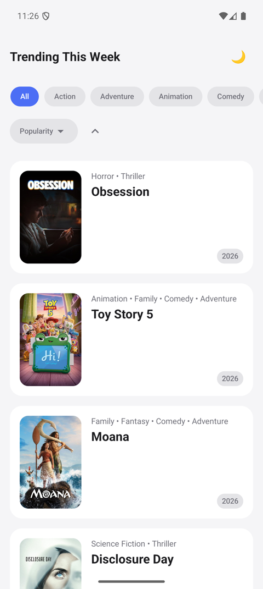
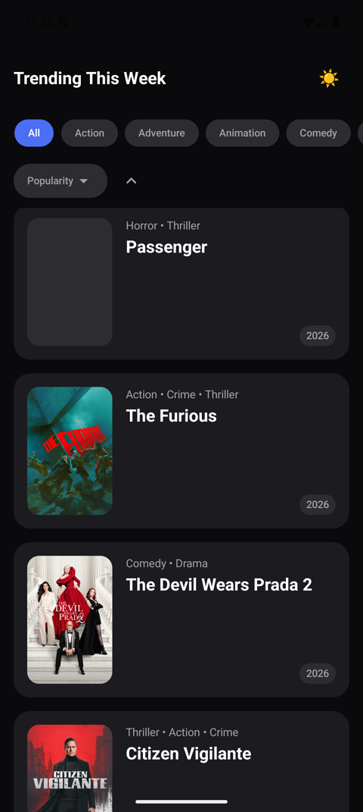
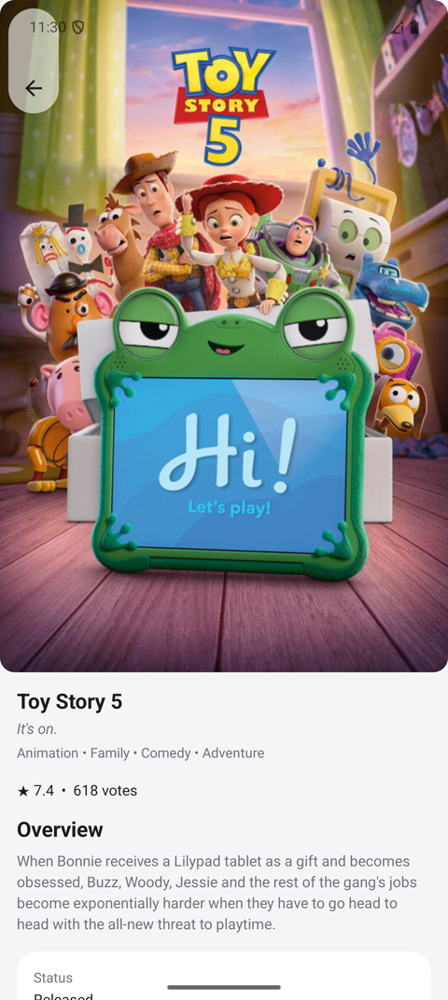

# AmroMovies


A native Android app for discovering this week's trending movies — a Clean Architecture,
multi-module MVP built entirely in Jetpack Compose: a trending list with genre filtering and
sorting, a full movie detail screen, offline-first caching, and light/dark theming, backed by
[TMDB](https://www.themoviedb.org/).

This README is written as a handover: what the app does, why it's built the way it is, and how
to run it. For the deeper, decision-by-decision rationale (and the trade-offs worth raising in
an interview), see [`ARCHITECTURE.md`](./ARCHITECTURE.md).

## Demo

<p>
  
  
  
</p>


## Features

- **Trending list** — this week's top 100 trending movies (5 paged TMDB requests merged
  client-side), each showing title, poster, genres, and release year.
- **Genre filter** — filters within the fetched 100 rather than trying to backfill more from the
  API, per the brief.
- **Sorting** — popularity (default), title, or release date, ascending or descending, with an
  animated sort-direction indicator.
- **Movie detail screen** — title, tagline, poster, genres, overview, vote average/count, budget,
  revenue, status, runtime, release date, and a link to IMDB.
- **Offline-first** — every screen renders from a local Room cache; a failed refresh falls back
  to whatever was last cached instead of an empty or broken screen.
- **Error handling** — explicit loading/error/content states with a retry action, at both the
  list and detail screen.
- **Light/dark theme** — follows the system setting by default, with a manual toggle.

## Architecture

Each feature module owns its **entire vertical slice** — data, domain, and presentation — rather
than reaching into a shared `core:domain` / `core:data`. This is a deliberate choice: the brief
calls for the codebase to support independent feature teams shipping new features (actor info,
user profiles, streaming, social) on top of this MVP without stepping on each other, and a
centralized domain/data module becomes exactly the kind of shared bottleneck that works against
that. `ARCHITECTURE.md` has the full reasoning and the rest of the decision log — offline-first
caching strategy, why Koin over Hilt, why Retrofit + kotlinx.serialization, and so on.

| Module | Responsibility |
|---|---|
| `app` | Composition root — `MainActivity`, `NavHost`, Koin startup |
| `design-system` | Theme, colors, typography, spacing, shapes, reusable Compose components |
| `core:common` | `Result<D, E>` / `DataError`, `UiState<T>` (`Loading`/`Success`/`Failure`), `DispatcherProvider` — infra only, no business logic |
| `core:network` | OkHttp/Retrofit/kotlinx.serialization setup, TMDB auth interceptor, `safeApiCall` |
| `core:testing` | MockK/AssertK/JUnit5 exposed as `api`, plus shared feature-agnostic test rules |
| `core:testing:coroutines` | `MainDispatcherRule` and other coroutine-test scaffolding |
| `core:testing:paparazzi` | The device/locale/font-scale Paparazzi matrix (`BasePaparazziMatrixTest`, `BasePaparazziComponentTest`) shared by every screen and `design-system` screenshot test |
| `feature:movies:domain` | Models, repository interface, use cases — no Android/Room/Retrofit deps |
| `feature:movies:data` | TMDB DTOs, Room entities/DAO, repository implementation |
| `feature:movies:presentation` | ViewModels, Compose screens, nav graph |

**Dependency rules:**

- `feature:*` depends on `core:*` and `design-system` — never the reverse.
- `core:*` modules never depend on each other's business logic, or on `feature:*`.
- Two features never depend on each other directly — cross-feature navigation is always a lambda
  callback assembled in `:app`.
- Within a feature, `data` and `presentation` both depend on `domain`; `presentation` never
  depends on `data` directly — they're wired together only via Koin DI modules assembled in
  `:app`.

**Presentation pattern (MVI)**, applied consistently across `feature:movies:presentation`:

- A single `StateFlow<State>` per screen — no independent `MutableStateFlow`s combined together.
- Async data within that state is a shared `core:common` `UiState<T>` (`Loading` / `Success` /
  `Failure`) rather than ad hoc `isLoading`/`hasError` booleans, so every screen renders its
  loading/error/content branches the same way.
- A sealed `Action` interface capturing user intent.
- The `ViewModel` is the only thing allowed to mutate state, via `.update { it.copy(...) }`.
- Navigation-triggering actions are intercepted directly in the screen's Root composable and
  forwarded to a plain callback — there's no `Channel`/event side-channel for that.

## Tech stack

| Concern | Choice | Why |
|---|---|---|
| UI | Jetpack Compose + Material 3 | Required by the brief; single source of truth for UI state |
| Architecture | Clean Architecture, MVI | Testable, unidirectional data flow, no scattered mutable state |
| DI | Koin | Plain Kotlin, no annotation-processing overhead for DI itself, fast multi-module builds |
| Networking | Retrofit + OkHttp + kotlinx.serialization | No reflection-based JSON (Gson/Moshi); serialization is compile-time checked |
| Persistence | Room | Single source of truth for the offline-first read path — the UI observes a typed `Flow` from the DB |
| Images | Coil 3 | Compose-first async image loading |
| Navigation | Navigation Compose, type-safe `@Serializable` routes | No string-based route args; each feature owns its own nav graph |
| Async | Kotlin Coroutines + Flow | `stateIn(WhileSubscribed)` for lazily-shared, lifecycle-aware ViewModel state |
| Unit testing | JUnit5 + MockK + AssertK | Modern JVM test stack; Flow-based state tested via a background collector + `runTest`, per [Android's testing guidance](https://developer.android.com/kotlin/flow/test) |
| Screenshot testing | Paparazzi | JVM-only Compose screenshot tests, no emulator needed |
| UI testing | Compose UI Test (instrumented) | Verifies real interaction (clicks, navigation callbacks) on-device |
| Build | Gradle version catalog + `build-logic` convention plugins | A new feature module's `build.gradle.kts` is ~10 lines |

Full version numbers live in [`gradle/libs.versions.toml`](./gradle/libs.versions.toml).

## Testing

227 tests across three layers:

| Layer | Tooling | Covers |
|---|---|---|
| Unit test | JUnit5, MockK, AssertK | Mappers and use cases (`SortMovies`, `FilterMoviesByGenre`, `RefreshTrendingMoviesUseCase`); the repository's offline-first fallback behavior; `safeApiCall`'s exception-to-`DataError` mapping; and both ViewModels, including their lazily-shared `stateIn(WhileSubscribed)` state |
| Screenshot | Paparazzi | Both feature screens (movies list, movie detail) — content/light/dark, loading, error, and empty states — plus every reusable `design-system` component (`AmroButton`, `AmroFilterChip`, `AmroPill`, `AmroPosterImage`, `AmroThemeToggleButton`), each rendered across a full device/locale/font-scale matrix. Runs on the JVM, no emulator required |
| Instrumented UI | Compose UI Test | Real click/navigation-callback behavior on a device or emulator |

```bash
./gradlew test                                               # unit tests
./gradlew :feature:movies:presentation:verifyPaparazziDebug  # screen screenshot tests
./gradlew :design-system:verifyPaparazziDebug                # component screenshot tests
./gradlew connectedDebugAndroidTest                          # instrumented UI tests (needs device/emulator)
```

### Scaling Paparazzi across the matrix, not the test count

Screenshot suites usually rot into one of two shapes: either they only cover a single device/locale
(and RTL or large-font regressions ship unnoticed), or every screen hand-writes its own loop over
device × locale × font size, so adding a new locale means touching every test file. Neither scales
past a couple of screens.

`core:testing:paparazzi` factors the matrix out instead: `PaparazziDeviceSize`, `PaparazziLocaleConfig`
(including Farsi for RTL), and `PaparazziFontScale` are plain enums combined by `deviceConfigOf(...)`
into a single `DeviceConfig`. Two small base classes drive `TestParameterInjector` over that matrix:

- `BasePaparazziMatrixTest(deviceSize, locale, fontScale)` — for full screens, where phone vs.
  tablet width genuinely changes layout.
- `BasePaparazziComponentTest(locale, fontScale)` — for standalone `design-system` components,
  which are wrap-content and don't vary by device width, so that dimension is dropped rather than
  wastefully re-rendering identical output per device size.

A screen or component test then just declares its states as normal `@Test` methods; `@TestParameter`
constructor params multiply every one of them across the injected matrix automatically. Adding a new
locale or font scale is a one-line enum addition in `core:testing:paparazzi` — every existing and
future Paparazzi test in the project picks it up with zero per-test changes.

### Coverage

Measured with [Kover](https://github.com/Kotlin/kotlinx-kover), merged across `app`,
`design-system`, `core:common`, `core:network`, and `feature:movies:{domain,data,presentation}`:

| Metric | Coverage |
|---|---|
| Line | 87.0% (860/989) |
| Instruction | 78.5% (7910/10069) |
| Class | 75.0% (75/100) |

```bash
./gradlew koverHtmlReport   # merged HTML report at build/reports/kover/html/index.html
./gradlew koverXmlReport    # merged XML report at build/reports/kover/report.xml
```

## Getting started

1. Get a free TMDB account and a **v4 Read Access Token** at
   [themoviedb.org/settings/api](https://www.themoviedb.org/settings/api) (not the v3 API key).
2. Copy `local.properties.sample` to `local.properties` and fill in `TMDB_READ_ACCESS_TOKEN`.
   (`local.properties` is gitignored — the build fails fast with a clear message if the key is
   missing.)
3. Open the project in Android Studio (or run `./gradlew :app:assembleDebug` from the CLI) and
   run the `app` configuration.

Minimum SDK 24, compile/target SDK 37.

## Known limitations / next steps

- `DataError` surfaces as a generic message rather than a localized, resource-backed one — fine
  for an MVP, but a `UiText`-style mapping from `DataError` to string resources would be the
  natural next step for i18n.
- No pagination beyond the fixed 100 trending movies, per the brief.
- Single data source (TMDB). The architecture — a repository interface, per-feature data
  ownership — is intentionally shaped to make adding a second source additive rather than a
  rewrite, but no second source is wired up yet.

---

*This started as a take-home interview assignment and is shared here for review as part of that
process.*
